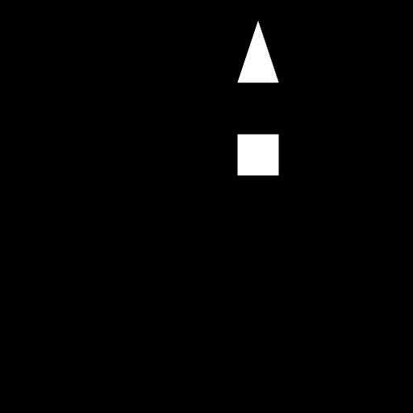
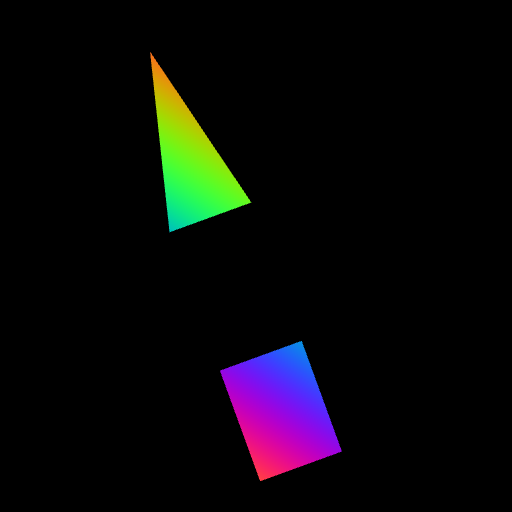

# Exercise 5: Moving, Reshaping and Colouring the Triangles

**Live page:** <https://wmslalalala.github.io/exercise5/>

A fork of the NCSU Computer Graphics Exercise 5 starter: a small WebGL rasterizer that reads
`triangles.json`, feeds the vertices straight through the vertex shader and paints every fragment
white. Only the two shaders in `setupShaders()` changed (plus the two data URLs, see the last
section).

| starter | this version |
| --- | --- |
|  |  |

## Vertex shader — move and reshape

The models live in `[0,1] x [0,1]` in world space, and the starter uses those coordinates as clip
coordinates, so everything lands in the upper right quadrant of the canvas and is drawn at half
scale. Three things happen instead now:

- **Move.** `vertexPosition.xy * 2.0 - 1.0` maps the unit square onto the whole `[-1,1]` clip
  square, so the models are centred and twice as large.
- **Reshape.** A `vec2(0.85, 1.15)` scale squashes them horizontally and stretches them
  vertically — enough to make the square visibly a rectangle and the triangle noticeably
  narrower — followed by a 20 degree rotation about the canvas centre, written out as a `mat2`.
- A final `+ vec2(0.30, 0.08)` nudge, because the rotation pushes the pair to the left.

`z` is passed through untouched, so the depth test still behaves the way the starter intended.

## Fragment shader — colour

The vertex shader hands the *untransformed* position to the fragment shader in a varying, so the
colour is attached to the model rather than to the screen: move the models and the colours travel
with them.

```glsl
float t = clamp((modelPosition.x + modelPosition.y - 0.3) / 0.9, 0.0, 1.0);
vec3 colour = 0.5 + 0.5*cos(6.2831853*(t + vec3(0.0, 0.33, 0.67)));
```

`t` runs along the diagonal of the model space, and the three cosines are a third of a period
apart, so the ramp sweeps the whole hue circle. The square sits low on the diagonal and gets the
magenta-to-blue part of it, the triangle sits high and gets green-to-orange, and each model keeps
a visible gradient inside itself — the interpolation of the varying across the triangle is doing
the work, which is the point of the exercise.

## One change outside the shaders

The starter reads `triangles.json` and `ellipsoids.json` from
`https://pages.github.ncsu.edu/cgclass/exercise5/`. That host is behind the NCSU enterprise login,
so a public `github.io` page gets a redirect to a login screen instead of JSON and nothing renders.
Both constants now point at the copies of those files that sit next to the page in this repo.
